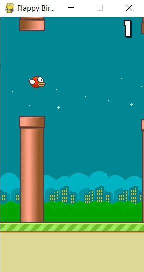

# Flappy Bird - Learn to play Flappy Bird using Genetic Programming and Reinforcement Learning
 I wrote the game in python using [pygame](http://www.pygame.org). I also wrote models that can learn to play Flappy Bird respectively, one using Genetic Programming and ons Deep Reinforcement Learning.
- To play the game, run `python game.py`. Use <kbd>Space</kbd> to flap the bird.
- To see the programm learning to play by itself, run `python FlappyBirdGA.py`. This one uses Genetic Programming.
- About Genetic Programming, on [Wikipedia](https://en.wikipedia.org/wiki/Genetic_programming), it stated that:
  >In artificial intelligence, genetic programming (GP) is a technique of evolving programs, starting from a population of unfit (usually random) programs, fit for a particular task by applying operations analogous to natural genetic processes to the population of programs.
- To see the programm using Deep Reinforcement Learning, run `python FlappyBird_deepRL.py`.

  ### Built-in GUI
Requirement: pygame
```bash
python game.py
```
**Game play**




